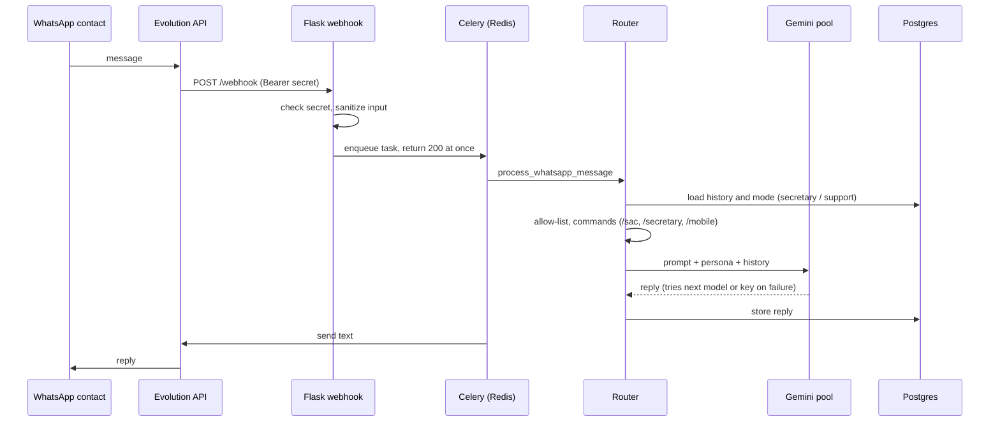

<p align="center">
  
</p>

<p align="center">
  
  
  
  
  
  
</p>

> A personal assistant that lives on WhatsApp. It answers only the contacts you allow, switches between an executive-assistant mode and a customer-support mode on command, remembers each conversation in Postgres, and keeps working when a model or an API key runs out of quota.

This is the Python version of the assistant. A lighter no-code version of the same idea, built with n8n, is in [n8n-whatsapp-waha](https://github.com/silvano-moraes-de-souza/n8n-whatsapp-waha).

## How a message flows



## What it does

| | |
|---|---|
| Channel | WhatsApp through [Evolution API](https://github.com/EvolutionAPI/evolution-api), with its own Postgres and Redis |
| Ingest | Flask webhook authenticated with a Bearer secret; input is sanitized and truncated before use |
| Async processing | The webhook only enqueues. A Celery worker (Redis broker, up to 3 retries) does the slow part, so Evolution API never waits on the model |
| Models | A pool of 11 Gemini models tried in order, across a primary and a fallback API key. `/mobile` routes to a local model served by LM Studio instead |
| Modes | `/secretary` (executive assistant) and `/sac` (customer support), stored per conversation |
| Memory | Conversation history and current mode per contact in Postgres |
| Access control | Only numbers or names in `ALLOWED_CONTACTS` get an answer; everything else is ignored silently |
| Replies | Kept to one short line, as a chat message should be |

About 1,160 lines of Python, plus the Compose stack.

## Run it

```bash
cp .env.example .env     # Evolution API, Gemini keys, webhook secret, DB passwords, OWNER_NUMBER
docker compose up -d     # Evolution API + Postgres + Redis, Luminus app + worker + Postgres + Redis
```

Then create the WhatsApp instance in Evolution API (`scripts/create_instance.json` is an example payload), scan the QR code, and point the instance webhook to `http://luminus_app:3000/webhook` with the same secret as `WEBHOOK_SECRET`.

Tests:

```bash
pip install -r requirements.txt pytest
PYTHONPATH=. pytest tests/test_memory.py tests/test_router.py
```

## Engineering decisions

| Decision | Why |
|---|---|
| Queue between webhook and model | LLM calls take seconds. Answering the webhook immediately avoids Evolution API timeouts and duplicate deliveries, and Celery retries failed jobs. |
| Model pool with key rotation | Free tiers hit rate limits several times a day. Walking a list of models and two keys turns an outage into a slightly different model answering. |
| Deterministic routing by command | Switching mode with `/sac` or `/secretary` is predictable and costs nothing, unlike asking a model to classify intent on every message. |
| Allow-list by default | A personal number receives spam and group messages. Answering only known contacts keeps the model bill and the risk down. |
| Secrets only in `.env` | API keys, webhook secret, database passwords and the owner's number are environment variables; nothing sensitive is in the code. |

## Limitations

- 2 of the 7 unit tests in `tests/test_router.py` are out of date: they expect a Groq node that the router no longer has.
- Audio messages are flagged but not transcribed.
- Evolution API uses the `latest` image tag; pin a version for anything beyond personal use.

## Author

**Silvano Moraes de Souza**, Software Engineer · Python, APIs, automation and data in production
[LinkedIn](https://www.linkedin.com/in/silvano-moraes-de-souza) · [Portfolio](https://silvanomsouza.vercel.app/) · [GitHub](https://github.com/silvano-moraes-de-souza)
